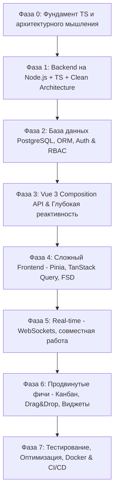

# 🚀 Менторский план: Fullstack-разработка на Vue 3 + TypeScript + Node.js

> **Проект:** «Среда» (Sreda) — Платформа для командной работы и управления проектами нового поколения (гибрид Linear, Notion-блоков и интерактивного дашборда в реальном времени).
>
> **Цель:** Пройти путь от базового знания JS/HTML/CSS до уверенного проектирования и разработки сложных fullstack-приложений (Vue 3, TypeScript, Clean/FSD-архитектура, Node.js, PostgreSQL, WebSockets, Docker).

---

## 🗺️ Карта развития (Roadmap)

---

## 📌 План модулей и прогресс

### 🔹 Фаза 0: Погружение в TypeScript и инструментарий
- [x] **0.1. TypeScript Core**:
  - Примитивы, интерфейсы (`interface`) vs типы (`type`).
  - Generics (обобщения), Union/Intersection types, Type Guards.
  - Utility Types (`Pick`, `Omit`, `Partial`, `Record`, `ReturnType`).
  - Strict mode, `tsconfig.json` и типизация сторонних библиотек.
- [x] **0.2. Организация монорепозитория / мультипакета**:
  - Настройка рабочего пространства (Monorepo с npm workspaces и polyglot apps).
  - Пакет `@sreda/shared` как единый источник правды контрактов.

---

### 🔹 Фаза 1: Backend Core на Node.js + TypeScript
- [x] **1.1. Архитектура Node.js & Runtime & Fastify Init**:
  - Инициализация `@sreda/server-fastify` на TypeScript + `tsx`.
  - Модульная слоистая структура (Controllers, Services, Routes, App Factory, Graceful Shutdown).
  - Связка с `@sreda/shared` (ApiResponse, Workspace).
- [x] **1.2. Архитектура приложения (Layered / Clean Architecture & Validation)**:
  - Controllers (маршруты и валидация) -> Services (бизнес-логика in-memory / ORM).
  - Сквозная валидация схем через `Zod` в `@sreda/shared` (`createWorkspaceSchema`, `CreateWorkspaceDto`).
  - Централизованная обработка ошибок (`AppError`, `NotFoundError`, `ConflictError`, `ValidationError` в `setErrorHandler`).
  - Интерактивная спецификация и тестирование через `api.http`.

---

### 🔹 Фаза 2: Базы данных, Безопасность и Авторизация
- [ ] **2.1. PostgreSQL & ORM**:
  - Реляционное моделирование: Таблицы `users`, `workspaces`, `projects`, `tasks`, `comments`.
  - Связи: 1-to-1, 1-to-many, many-to-many. Индексы и оптимизация запросов.
  - Выбор ORM/Query Builder: *Drizzle ORM vs Prisma* (плюсы, минусы, производительность).
  - Миграции и сидинг данных.
- [ ] **2.2. Authentication & Authorization (Безопасность)**:
  - Хеширование паролей (`argon2` / `bcrypt`).
  - JWT архитектура: Access Token (в памяти/заголовке) + Refresh Token (HttpOnly Cookie, ротация сессий в Redis/Postgres).
  - RBAC (Role-Based Access Control): Роли `Owner`, `Admin`, `Member`, `Viewer` с гранулярными правами.
  - Защита: CORS, Rate Limiting, Helmet, XSS, CSRF.

---

### 🔹 Фаза 3: Vue 3 — От основ к Reactivity Engine
- [ ] **3.1. Глубокое понимание Reactivity**:
  - Как работает Reactivity под капотом (Proxy, `track`, `trigger`, `effect`).
  - `ref` vs `reactive` vs `shallowRef` vs `toRefs` (когда что применять и типичные грабли с потерей реактивности).
  - `computed` (кеширование, геттеры/сеттеры), `watch` vs `watchEffect`.
- [ ] **3.2. Компонентная модель Vue 3**:
  - `<script setup lang="ts">`, `defineProps`, `defineEmits`, `defineModel` (Vue 3.4+).
  - Слот-ориентированный дизайн (Scoped Slots, Dynamic Slots).
  - Provide / Inject для сложного проп-дриллинга.
  - Директивы и хуки жизненного цикла (`onMounted`, `onUnmounted`, `onErrorCaptured`).

---

### 🔹 Фаза 4: Продвинутый Frontend & State Management
- [ ] **4.1. Архитектура Frontend (Feature-Sliced Design / Модульная)**:
  - Разделение ответственности: `app`, `pages`, `widgets`, `features`, `entities`, `shared`.
  - Кастомные композаблы (`composables`): инкапсуляция логики, реактивный контекст, очистка ресурсов.
- [ ] **4.2. Управление состоянием (State Management)**:
  - *Server State vs Client State*:
    - Серверное состояние: `@tanstack/vue-query` (кеширование, фоновая инвалидация, optimistic updates).
    - Клиентское состояние: `Pinia` (настройки темы, сайдбар, активные модалки, сессия).
- [ ] **4.3. Маршрутизация (Vue Router 4)**:
  - Вложенные маршруты (Layouts), dynamic imports (code splitting).
  - Navigation Guards (проверка авторизации, прав доступа, загрузка метаданных).
  - Typed routes и работа с Query-параметрами.

---

### 🔹 Фаза 5: Real-Time & WebSockets
- [ ] **5.1. Полнодуплексная связь**:
  - Когда применять: *WebSockets vs Server-Sent Events (SSE) vs Polling*.
  - Node.js WebSocket сервер (`ws` / `Socket.io`) с авторизацией по токену.
  - Vue Composable для WebSockets: авто-реконнект, heartbeat/ping-pong, очередь сообщений при оффлайне.
- [ ] **5.2. Коллаборативные функции**:
  - Live Cursors & Presence (кто сейчас в проекте / на карточке задачи).
  - Мгновенные уведомления и бейджи.
  - Optimistic UI с откатом при ошибках сети.

---

### 🔹 Фаза 6: Сложные UI-механики и фичи проекта «Среда»
- [ ] **6.1. Интерактивная Kanban-доска (Linear-style)**:
  - Drag-and-Drop (HTML5 Drag & Drop API / `@formkit/drag-and-drop` / `vuedraggable`).
  - Виртуализация списков для высокой производительности при 1000+ карточках (`vue-virtual-scroller`).
  - Быстрые горячие клавиши (Command Palette `Cmd+K`).
- [ ] **6.2. Rich-Text / Block-редактор заметок (Notion-style)**:
  - Интеграция Tiptap / ProseMirror с кастомными расширениями на Vue.
- [ ] **6.3. Кастомная дизайн-система**:
  - Токены, CSS Variables, Тёмная/Светлая тема.
  - Headless UI компоненты (доступность a11y, фокус-ловушки).

---

### 🔹 Фаза 7: Качество, Тесты, DevOps & Деплой
- [ ] **7.1. Тестирование**:
  - Unit-тесты: Vitest для композаблов, сервисов и утилит.
  - Component-тесты: `@vue/test-utils` / Playwright Component Testing.
  - E2E-тесты: Playwright.
- [ ] **7.2. Docker & Инфраструктура**:
  - `Dockerfile` (Multi-stage build для Node.js и Nginx/Vue).
  - `docker-compose.yml` (App + Postgres + Redis).
  - CI/CD пайплайн на GitHub Actions (линты, тесты, сборка).

---

## 📝 Журнал уроков и задач (Learning Log)

| Шаг | Тема | Статус | Комментарий ментора / Результат |
|---|---|---|---|
| **0.1** | Инициализация монорепозитория (workspaces) | ✅ Выполнено | Структура apps/ и packages/ настроена, package.json скорректирован |
| **0.2** | TypeScript: Базовые конфиги и доменные типы | ✅ Выполнено | tsconfig.base.json, доменные модели и Discriminated Unions |
| **1.1** | Fastify Backend & Промышленная архитектура | ✅ Выполнено | Модули, слои (Controllers, Services, Routes), Graceful Shutdown |
| **1.2** | Zod-валидация & Централизованная обработка ошибок | ✅ Выполнено | Zod DTO в shared, AppError, errorHandler в Fastify, api.http тесты |
| **2.1** | PostgreSQL & Drizzle ORM | 🔄 Следующий шаг | Моделирование БД, миграции, подключение репозиториев |
